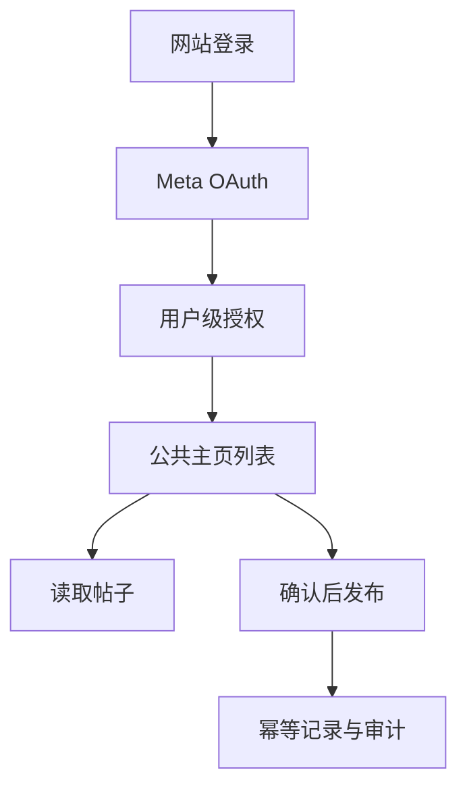

# 独立架构

## 隔离保证

- 仓库、Vercel Project、数据库、OAuth 回调地址和加密密钥均独立。
- 数据模型没有 Organization、Tenant、Workspace 或 orgId。
- 所有授权、主页、帖子操作都从服务端登录会话取得 `userId`，不接受客户端传入用户标识。
- 原广告系统不会作为运行时依赖。

## 迁移范围

迁移 Meta OAuth、Page Token 加密、主页能力判定、读取帖子和发帖能力。评论回复/隐藏与删除帖子可在后续版本基于同一用户级授权边界继续增加。
